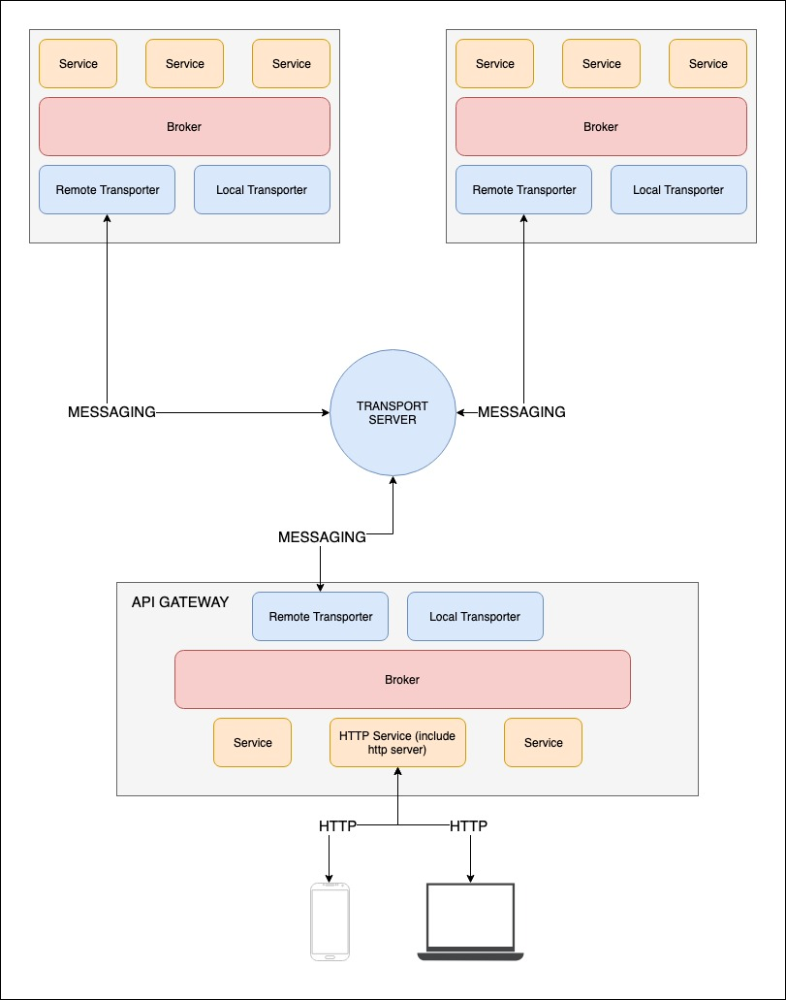

# UNDER CONSTRUCTION
This library is under construction, only use it if you want to experiment.
Any contribution is welcome.

### Why Bulb?
Bulb is an lightweight microservices framework with simple, familiar syntax that was inspired by [ExpressJS](https://github.com/expressjs/express),
allow you to create transport layer for microservices in Rust as quick as possible.

Currently, Bulb is building around [nats](https://github.com/nats-io/nats-server) as central messaging system.
Bulb also have a local pubsub system, that allow services on same server communicate with each other fastest without remote messaging system.

### Concept:


### Usages

**NOTE**: This is just the ideal flow of Bulb, the framework is still under construction.

```rs
let broker = Broker::new(LocalTransporter::new());

let foo_service = broker.borrow_mut().create_service("foo".to_owned());
let bar_service = broker.borrow_mut().create_service("bar".to_owned());

// Subscribe to an action for "foo"
foo_service.borrow_mut().subscribe("hello".to_owned(), Box::new(|ctx| {
    println!("Foo Hello World!: {:?}", ctx);
}));

thread::sleep(Duration::from_millis(1000));

// Call an action of "foo" from "bar"
bar_service.borrow().call(
    Context::default(),
    String::from("foo"), 
    String::from("hello"), 
    String::from("sample json data"),
);
```

### Roadmap

- [] Request-Reply
- [] Transporter
    - [] Nats
    - [] TCP
    - [] Kafka
- [] Serializers
    - [] JSON
    - [] Protocol Buffer
- [] API Gateway
- [] Service Registry
    - [] Service discovery
    - [] Heath check
- [] Fault tolerance
    - [] Load balancer (built-in if using Nats or Kafka).
    - [] Circuit breaker.
    - [] Retries & Timeout.
    - [] Bulkhead.
- [] Middleware
- [] Logger
- [] Metrics/Services monitoring cli tool
- [] Stream (for streaming files through services,...)

